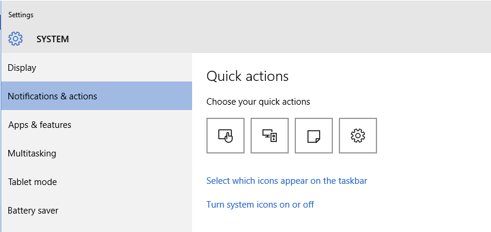
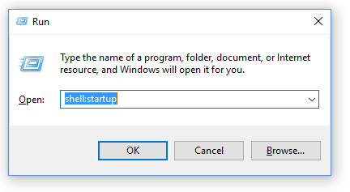

Virtual Desktop Grid Switcher Installation
==========================================

I hate installers that do god knows what to your computer so you won’t find one here but you will need to do a few things manually.

1.  Decide where you want to put the VirtualDesktopGridSwitcher installation folder.

    Personally I like to create a folder called Programs alongside the Documents, Pictures, Videos folders in my user folder– something like C:\\Users\\simonl\\Programs – and then create a folder VirtualDesktopGridSwitcher below that.

2.  Download the installation zip file from <http://sourceforge.net/projects/virtual-desktop-grid-switcher/files/> and copy/extract the contents of the zip file you downloaded into your installation folder.

    If you are upgrading you can just copy over the top. You may want to exclude the Icons folder if you have modified them. If you prefer you can create a new folder and copy in your icons folder and if you have changed from the default settings you will also find a file called VirtualDesktopGridSwitcher.Settings in your old install folder.

3.  Double-click VirtualDesktopGridSwitcher.exe to run it.

4.  To keep the System Tray Icon always visible open Settings -&gt; System -&gt; Notifications & actions and click “Select which icons appear on the taskbar”. Find Virtual Desktop Grid Switcher and set to on.

    

5.  If you want VirtualDesktopGridSwitcher to run on startup add a shortcut to VirtualDesktopGridSwitcher.exe to your startup folder. You can open your startup folder by pressing the Windows key and R key together to open the run dialog and entering shell:startup

    

    You can create a shortcut by opening another windows explorer window, finding VirtualDesktopGridSwitcher.exe, hold down the Alt key and drag it to your startup folder.
