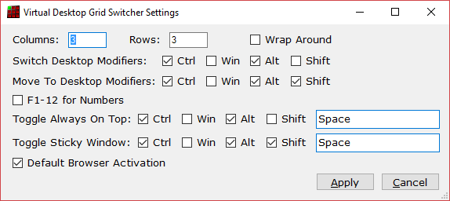

Virtual Desktop Grid Switcher
=============================

Virtual Desktop Grid Switcher allows you to switch and move the current active window between Windows 10 Virtual Desktops in a virtual grid layout using arrow keys. This is helpful if like me you use more than a few desktops. The default layout is a 3x3 grid of desktops.

Once the application is running you will see a new icon in your system tray.

If you right click this you can exit or modify the settings.

Layout and Appearance
---------------------

You can change the Columns and Rows in your grid. If you do this you will probably want to change the icons used for each desktop. These can be found in the Icons folder of your installation. Alternative icon sets are available from VirtuaWin which inspired the development of this program at http://virtuawin.sourceforge.net/?page\_id=48.

When you increase the number of desktops required they automatically created for you. Reducing the number required leaves them for you to delete using the usual method (but you will not be able to access them via the arrow keys).

DO NOT PUT TOO LARGE NUMBERS IN THE ROWS AND COLUMNS AS WINDOWS WILL GRIND TO A HALT with so many desktops and you will have a hard time deleting them all. Even restarting won’t help!

You can enable Wrap Around mode which means that if you go right from the rightmost desktop it wraps around to the leftmost in the same row and vice versa and same for up and down in columns.

Key Assignment
--------------

You can change the modifier key combinations for switching desktops and for moving the currently active window to another desktop and switching to that desktop. Note if another program is already using a key combination you will be warned that it could not be assigned. You will either need to change the key combinations or find out what is using it already and stop it from doing so. Often your graphics software has some of these keys assigned.

You can also switch/move to a particular desktop by number. The default is to use the plain number keys. You can switch to the F1-12 keys but these are very commonly already assigned for other uses.

Support
-------

If you have questions please ask them on the SourceForge Discussion Page <https://sourceforge.net/p/virtual-desktop-grid-switcher/discussion/>

If you think something is not working correctly raise a ticket on the SourceForge Tickets Page <https://sourceforge.net/p/virtual-desktop-grid-switcher/tickets/>
